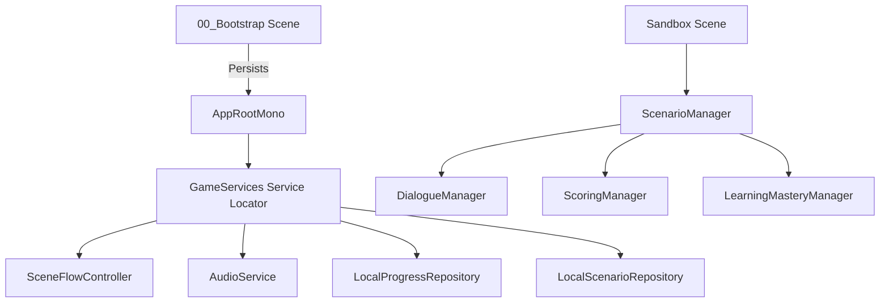

# Architecture Overview

Nihongo Life is built on a highly modular, decoupled architecture where gameplay, dialogue, objectives, scoring, and UI are coordinated by a central, data-driven core. This design separates content definition (scenarios, dialogue trees, target vocabulary) from the runtime engine.

## Core Hierarchy

## Architectural Decoupling

1. **Services Locator (`GameServices`)**:
   Core platform systems (Scene Loading, Audio, Saves, Scenario Assets) register themselves at boot as interfaces (`IGameService`). Gameplay components access them dynamically, allowing replacement of the local progress saver with an API-based Supabase writer without changing gameplay scripts.

2. **Scenario Engine (`ScenarioManager`)**:
   Instead of coding separate levels (e.g. `KonbiniManager`, `RamenManager`), the engine loads a generic `ScenarioDefinition` asset (ScriptableObject) containing objectives and dialogue trees. The scenario runs purely based on node instruction trees.

3. **Dialogue & Learning Modes (`DialogueManager`)**:
   Manages dialogue layouts, text rendering (Japanese text, readings, romaji, and translations), voice audio triggers, and choice branches. Depending on the global `LearningMode` (Guided, Practice, Assessment), reading guides and Vietnamese translations are selectively shown or hidden dynamically.

4. **Mastery Tracking (`LearningMasteryManager`)**:
   Maintains progress records for individual N5 grammatical structures or vocabulary words. When scenarios finish successfully, Mastery values are updated using exponential smoothing based on the overall assessment scores.
